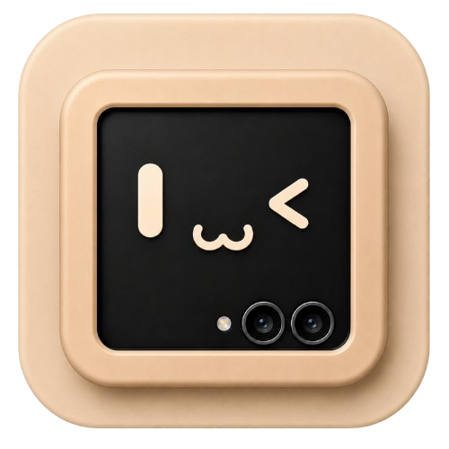

# miniMont

Your folded phone, being the computer.

miniMont turns a Samsung Galaxy Z Flip into a desktop on another screen — its own
desktop, not Samsung's. It replaces DeX rather than dressing it up, and it is
built to work with AirMate, so the screen it fills can be a tablet you already
own.

Built for the Galaxy Z Flip 7.

## What it does

- **A desktop of its own** — wallpaper, taskbar, app drawer, notification centre.
  DeX is not underneath it: the display comes up with nothing on it and miniMont
  puts everything there.
- **Windows** — any Android app, in freeform, opened at a size a desktop expects
  rather than the size a phone would have chosen.
- **A taskbar** — what is open, what you pinned, and the clock, the battery and
  what is waiting, each one answering a right click with the phone's own screen
  for it.
- **A desktop you can arrange** — application shortcuts and app widgets on a
  launcher's grid, moved and resized where they stand.
- **The phone is the input** — the cover display is the touchpad and the keyboard
  while the desktop runs, so a phone in your hand is a whole computer. A real
  mouse and keyboard work too, and are never required.

## AirMate is the other half

miniMont makes the display and draws the desktop; AirMate carries the picture to
a tablet over Wi-Fi and sends your touches back. Put both on the same network and
they find each other.

A monitor on the USB-C port works as well, and anything else — Smart View, a
Chromecast, a dock you like — is Samsung's business and yours. miniMont does not
compete with it and does not pretend to support it.

[AirMate](https://github.com/RimorCosmicam/AirMate) · [MiniDex](https://github.com/RimorCosmicam/miniDex) · [MiniMate](https://github.com/RimorCosmicam/miniMate)

## What it needs

Wireless ADB, paired once, on the phone itself.

Not a preference, and there is no reduced mode behind it: only the shell user may
create a display that will hold another app's windows. Everything miniMont is
rests on that one permission, so the pairing is the first screen and the app says
so plainly. It pairs on-device — no computer, no cable, no Shizuku.

## Building

```
./gradlew assembleDebug
```

One APK holds both halves: the app, and the shell-side host compiled into the
same artifact. Nothing is pushed to `/data/local/tmp` — `app_process` is handed
this APK's own installed path, so there is one thing to install and no writable
copy of miniMont's code sitting where anything else on the device could read it.

GitHub Actions builds it on every push.

```
gh run download <run-id> -R RimorCosmicam/miniMont -n minimont-debug-apk
```

## How it works

Three processes on one phone. A shell-uid host that owns the display, the
encoder and input; the app, which is the cover screen and draws the desktop onto
that display; and Android, which knows nothing about any of it.

The documents in [`docs/`](docs/) were written before the code and say plainly
which parts of them were guesses — and which of those guesses have since been
measured on a real phone.

## Open source

MIT. Do what you like with it (but let me know, I love cool stuff).
